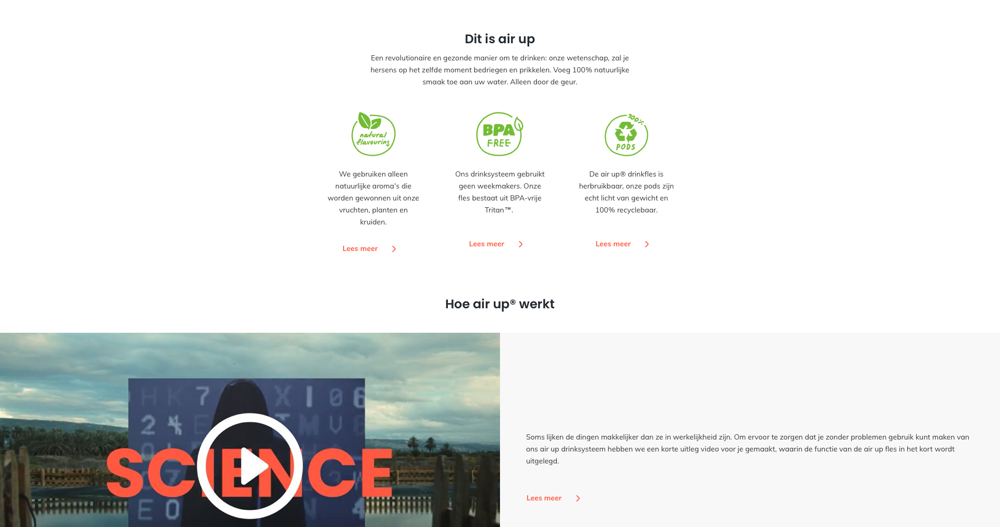
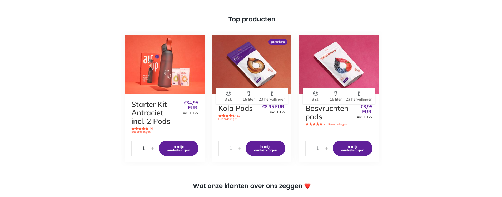
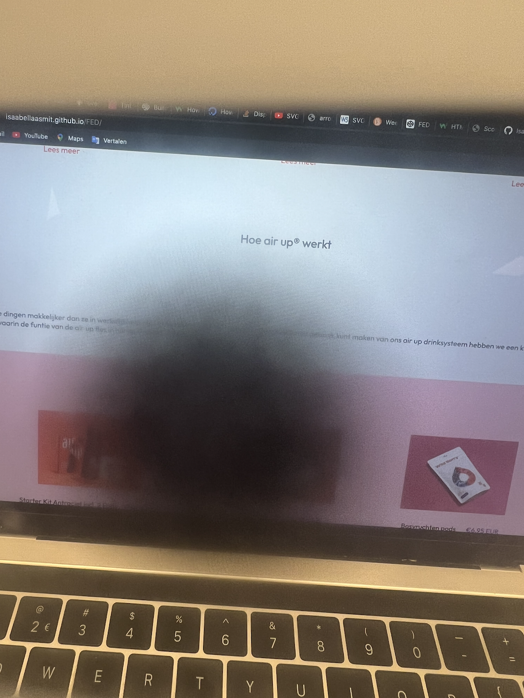

# Procesverslag
Markdown is een simpele manier om HTML te schrijven.  
Markdown cheat cheet: [Hulp bij het schrijven van Markdown](https://github.com/adam-p/markdown-here/wiki/Markdown-Cheatsheet).

Nb. De standaardstructuur en de spartaanse opmaak van de README.md zijn helemaal prima. Het gaat om de inhoud van je procesverslag. Besteedt de tijd voor pracht en praal aan je website.

Nb. Door *open* toe te voegen aan een *details* element kun je deze standaard open zetten. Fijn om dat steeds voor de relevante stuk(ken) te doen.

## Jij

uitwerken voor kick-off werkgroep

### Auteur:
Isabella Smit

#### Je startniveau:
Blauw

#### Je focus:
Ik hoop op beide te kunnen focussen om zo het meest te leren (kies uit responsive óf surface plane)
 

## Je website

uitwerken voor kick-off werkgroep

### Je opdracht:
 Ik ga de site van <a href="https://nl.air-up.com/">Air Up</a> als voorbeeld nemen.

#### Screenshot(s) van de eerste pagina (small screen): 
Home pagina  

 
 

#### Screenshot(s) van de tweede pagina (small screen):
Duurzaam pagina  

 
 

## Breakdownschets (week 1)

uitwerken na afloop 2e werkgroep

### de hele pagina: 

### dynamisch deel (bijv menu): 

### wellicht nog een dynamisch deel (bijv filter): 

## Voortgang 1 (week 2)

uitwerken voor 1e voortgang

### Stand van zaken
Wat ik tot nu toe heb is een prima opzet om mijn website af te maken. Ik heb deze week alle content in de html gezet en kan ik vanaf nu alleen maar aan de slag gaan met de opmaak in css.

### Mijn Site op Github
<a href="https://github.com/Isaabellaasmit/Airup2.0.git">Link naar mijn site</a>

### Agenda voor meeting
samen met je groepje opstellen (Aishani, Romy en Brent)

| Punt 1         | Punt 2          | Punt 3         | 
| ---            | ---             | ---            | 
| Beste optie    | Het maken van   | Het uitwerken  | 
| voor een       | een searchbar   | van Humpty     | 
| caroussel      |                 |                | 

### Verslag van meeting
hier na afloop snel de uitkomsten van de meeting vastleggen

- Punt 1: Je kan het beste geen caroussel maken, maar je moet gebruik maken van divs en scrollen
- Punt 2: Je kan een searchbar maken door een form toe te voegen
- Punt 3: Je kan bij de site van Sannen bij inspecteren de code bekijken

Verder goed opweg, maar moet goed de opdrachten blijven maken en toepassen op mijn eigen werk.

## Voortgang 2 (week 3)

uitwerken voor 2e voortgang

### Stand van zaken
Ik ben begonnen met de animaties en posities

### Agenda voor meeting
samen met je groepje opstellen

| Punt 1                    | Punt 2                        | Punt 3                                       | student 4        |
| ---                       | ---                           | ---                                          | 
| Kan een nav in de footer? | Kunnen er 2 h2 in een article | is webkit-sticky nodig voor position sticky? | 
|                           |                               |                                              | dit wil ik zeker |
|                           |                               |                                              |                  |
 

### Verslag van meeting
hier na afloop snel de uitkomsten van de meeting vastleggen

- punt 1: Het beste is om een nav in de header te doen en dan later te positioneren
- punt 2: Nee, het kan op een andere misschien betere manier worden opgelost
- punt 3: Webkit-sticky is er om verschillende browsers te ondersteunen

## Toegankelijkheidstest (week 4)

uitwerken na test in 8e voortgang

### Bevindingen
Lijst met je bevindingen die in de test naar voren kwamen:

#### Contrast
 Hier korte omschrijving (met indien nodig een afbeelding):
Ik had hele dunne letters die overeen kwamen met de oorspronkelijke site, maar toen we gingen testen kwam ik er achter dat die letter niet zichbaar zijn voor mensen die niet goed contrast kunnen zien.
 
 
 

Hier een omschrijving van hoe het opgelost kan worden (met indien nodig een afbeelding)
Het kan heel makkelijk worden opgelost als de dikte en grootte van een font worden aangepast
 
 
#### Blinde vlek
Hier korte omschrijving:
 Mijn site is wat ik uit de test haalde nog prima te doen met een blinde vlek. Grote oppervlakten en veel witruimte.
 
 
 

Hier een omschrijving van hoe het opgelost kan worden (met indien nodig een afbeelding)
Er kan mogelijk nog rekening gehouden worden met de uitlijning, maar dan zou ik de test nog een keer moeten doen om te kijken wat het effect daarvan zal zijn.

#### Parkingson 
Hier korte omschrijving:
 Het is niet fijn om parkingson te hebben, maar er zijn een aantal mensen die daar toch mee moeten dealen. Mijn website is toegankelijk in het gebruik van linkjes en om het te bedienen met je keyboard.

Hier een omschrijving van hoe het opgelost kan worden:
 Alleen de linkjes kunnen bedienen met je toetsenbord is niet voldoende, dus mijn website zou daar nog even goed op aangescherpt kunnen worden.

#### Screenreader 
Hier korte omschrijving:
 Medelijden met de mensen die een screenreader nodig hebben om gebruik te kunnen maken van het internet. Hoewel mijn webdite wel verstaanbaar is op de screenreader moet er meer rekening gehouden worden met andere pagina's. |Mijn hoofpagina is voornamelijk tekst en dat valt moeilijk te vernagellen met een goede alt voor afbeeldingen en samantische html.

Hier een omschrijving van hoe het opgelost kan worden
 mocht ik meer pagina's gaan maken moet ik goed kijken of alles te bereiken valt met het gebruik van een toetsenbord.

## Voortgang 3 (week 4)

uitwerken voor 3e voortgang

### Stand van zaken
Ik ben vooral bezig met alles nog op de goede plek zetten en als ik nog tijd over heb zou ik graag nog iets gaafs willen maken.
  
 
 

### Agenda voor meeting
samen met je groepje opstellen

| Punt 1      |  Punt 2
| ---            | ---  
|   een goede opmaakt voor een search balk         | Het responsive maken van onderdelen op een klein scherm
             |  
|            | 

### Verslag van meeting
hier na afloop snel de uitkomsten van de meeting vastleggen

- punt 1: Er kan even goed gekeken worden naar de opdrachten in pencode van Sanne, daar valt veel vandaan te halen
- punt 2: Dat kan het beste met het gebruik van een media query

## Eindgesprek (week 5)

uitwerken voor eindgesprek

### Stand van zaken
hier dit ging goed:
 het positioneren ging erg goed. je bent er wel even mee bezig, maar het is een beetje een soort puzzel. Als je maar doorgaat, dan kom je er wel uit

 
 & dit was lastig:
 Ik kwam er moeilijk uit met javaschript ik heb een aatal dingen geprobeert, maar het lukte niet echt. Ik snap het wel, maar ik heb daar wat meer tijd voor nodig en die had ik niet. 
### Screenshot(s)

hier screenshot(s) van je eindresultaat

 
 
 
 
 

## Bronnenlijst

continu bijhouden terwijl je werkt

Nb. Wees specifiek ('css-tricks' als bron is bijv. niet specifiek genoeg).

1. https://www.w3schools.com/css/css3_shadows_box.asp 
2. https://www.w3schools.com/howto/howto_css_sticky_element.asp 
3. https://www.digitalocean.com/community/tutorials/css-position-sticky
4. https://stackoverflow.com/questions/12105214/display-text-on-mouseover-for-image-in-html
5. https://www.squarespace.com/?channel=pnb&subchannel=go&campaign=pnb-go-row_weu-en-website_general-phr&subcampaign=(website-alone_website_phr)&&utm_source=google&utm_medium=pnb&utm_campaign=pnb-go-row_weu-en-website_general-phr&utm_term=website&gclid=Cj0KCQiAhf2MBhDNARIsAKXU5GSxAviMXTj_I7-SEaqJiglkP9aTESAfEd6vBuutPusCBkkD-2MzI18aAsmzEALw_wcB&gclsrc=aw.ds 
6. https://developer.mozilla.org/en-US/docs/Web/CSS/overflow 
7. https://stackoverflow.com/questions/53422027/how-to-use-downloaded-image-or-fontzip-file-in-css
8. https://stackoverflow.com/questions/43371912/how-to-make-an-html-css-js-color-changing-background-like-kahoot-it-has 
9. https://www.internetingishard.com/html-and-css/forms/#email-input-fields
10. https://dlo.mijnhva.nl/d2l/le/content/324289/Home 
11. https://stuffandnonsense.co.uk/blog/redesigning-your-product-and-website-for-dark-mode
12. https://www.w3schools.com/css/css_background_image.asp
13. https://www.squarespace.com/?channel=pnb&subchannel=go&campaign=pnb-go-row_weu-en-website_general-phr&subcampaign=(website-alone_website_phr)&&utm_source=google&utm_medium=pnb&utm_campaign=pnb-go-row_weu-en-website_general-phr&utm_term=website&gclid=Cj0KCQiAhf2MBhDNARIsAKXU5GSxAviMXTj_I7-SEaqJiglkP9aTESAfEd6vBuutPusCBkkD-2MzI18aAsmzEALw_wcB&gclsrc=aw.ds

