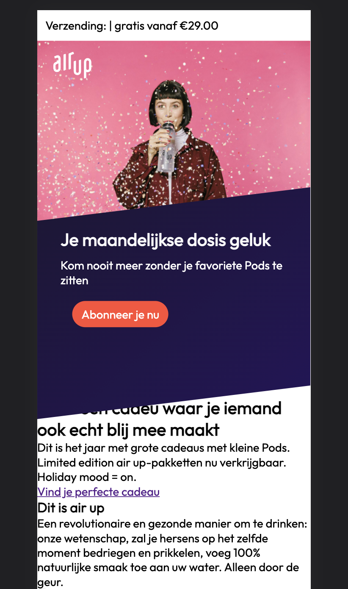

# Procesverslag
Markdown is een simpele manier om HTML te schrijven.  
Markdown cheat cheet: [Hulp bij het schrijven van Markdown](https://github.com/adam-p/markdown-here/wiki/Markdown-Cheatsheet).

Nb. De standaardstructuur en de spartaanse opmaak van de README.md zijn helemaal prima. Het gaat om de inhoud van je procesverslag. Besteedt de tijd voor pracht en praal aan je website.

Nb. Door *open* toe te voegen aan een *details* element kun je deze standaard open zetten. Fijn om dat steeds voor de relevante stuk(ken) te doen.

## Jij

uitwerken voor kick-off werkgroep

### Auteur:
Isabella Smit

#### Je startniveau:
Blauw

#### Je focus:
Ik hoop op beide te kunnen focussen (kies uit responsive óf surface plane)
 

## Je website

uitwerken voor kick-off werkgroep

### Je opdracht:
 Ik ga de site van <a href="https://nl.air-up.com/">Air Up</a> als voorbeeld nemen.

#### Screenshot(s) van de eerste pagina (small screen): 
hier de naam van de pagina  

#### Screenshot(s) van de tweede pagina (small screen):
hier de naam van de pagina  

 

## Breakdownschets (week 1)

uitwerken na afloop 2e werkgroep

### de hele pagina: 

### dynamisch deel (bijv menu): 

### wellicht nog een dynamisch deel (bijv filter): 

## Voortgang 1 (week 2)

uitwerken voor 1e voortgang

### Stand van zaken
Wat ik tot nu toe heb is een prima opzet om mijn website af te maken. Ik heb deze week alle content in de html gezet en kan ik vanaf nu alleen maar aan de slag gaan met de opmaak in css.

### Mijn Site op Github
<a href="https://github.com/Isaabellaasmit/Airup2.0.git">Link naar mijn site</a>

### Agenda voor meeting
samen met je groepje opstellen (Aishani, Romy en Brent)

| Punt 1         | Punt 2          | Punt 3         | 
| ---            | ---             | ---            | 
| Beste optie    | Het maken van   | Het uitwerken  | 
| voor een       | een searchbar   | van Humpty     | 
| caroussel      |                 |                | 

### Verslag van meeting
hier na afloop snel de uitkomsten van de meeting vastleggen

- Punt 1: Je kan het beste geen caroussel maken, maar je moet gebruik maken van divs en scrollen
- Punt 2: Je kan een searchbar maken door een form toe te voegen
- Punt 3: Je kan bij de site van Sannen bij inspecteren de code bekijken

Verder goed opweg, maar moet goed de opdrachten blijven maken en toepassen op mijn eigen werk.

## Voortgang 2 (week 3)

uitwerken voor 2e voortgang

### Stand van zaken
Ik ben begonnen met de animaties en posities

### Agenda voor meeting
samen met je groepje opstellen

| student 1      | student 2          | student 3    | student 4        |
| ---            | ---                | ---          | ---              |
| dit bespreken  | en dit             | en ik dit    | en dan ik dat    |
| en dat ook nog | dit als er tijd is | nog een punt | dit wil ik zeker |
| ...            | ...                | ...          | ...              |

### Verslag van meeting
hier na afloop snel de uitkomsten van de meeting vastleggen

- punt 1
- punt 2
- nog een punt
- ...

## Toegankelijkheidstest (week 4)

uitwerken na test in 8e voortgang

### Bevindingen
Lijst met je bevindingen die in de test naar voren kwamen:

#### Titel eerste bevinding
Hier korte omschrijving (met indien nodig een afbeelding)

Hier een omschrijving van hoe het opgelost kan worden (met indien nodig een afbeelding)

#### Titel tweede bevinding. 
Hier korte omschrijving (met indien nodig een afbeelding)

Hier een omschrijving van hoe het opgelost kan worden (met indien nodig een afbeelding)

#### Titel volgende bevinding. 
Hier korte omschrijving (met indien nodig een afbeelding)

Hier een omschrijving van hoe het opgelost kan worden (met indien nodig een afbeelding)

#### Titel nog een bevinding. 
Hier korte omschrijving (met indien nodig een afbeelding)

Hier een omschrijving van hoe het opgelost kan worden (met indien nodig een afbeelding)

## Voortgang 3 (week 4)

uitwerken voor 3e voortgang

### Stand van zaken
hier dit ging goed & dit was lastig (neem ook screenshots op van delen van je website en code)

### Agenda voor meeting
samen met je groepje opstellen

| student 1      | student 2          | student 3    | student 4        |
| ---            | ---                | ---          | ---              |
| dit bespreken  | en dit             | en ik dit    | en dan ik dat    |
| en dat ook nog | dit als er tijd is | nog een punt | dit wil ik zeker |
| ...            | ...                | ...          | ...              |

### Verslag van meeting
hier na afloop snel de uitkomsten van de meeting vastleggen

- punt 1
- punt 2
- nog een punt
- ...

## Eindgesprek (week 5)

uitwerken voor eindgesprek

### Stand van zaken
hier dit ging goed & dit was lastig (neem ook screenshots op van delen van je website en code)

### Screenshot(s)

hier screenshot(s) van je eindresultaat

## Bronnenlijst

continu bijhouden terwijl je werkt

Nb. Wees specifiek ('css-tricks' als bron is bijv. niet specifiek genoeg).

1. bron 1
2. bron 2
3. ...

